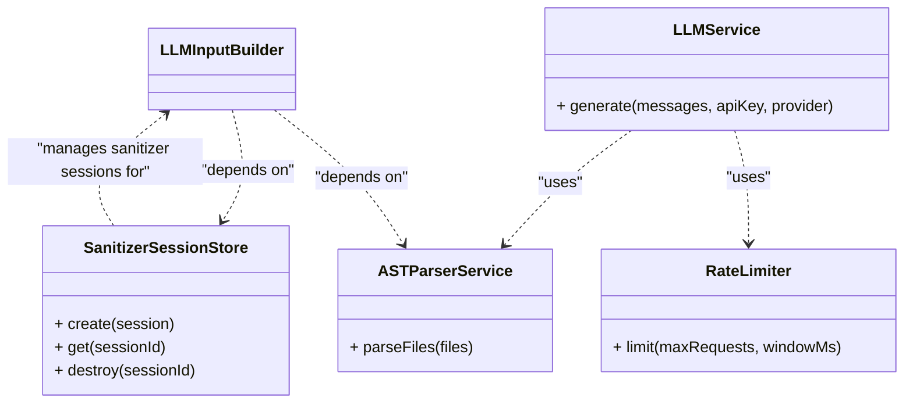

# 📚 Documentation: Auto-Doc

> Auto-generated by Auto-Doc on 2026-05-12 16:16:24
> [View Live Site](https://eljaouadimazen.github.io/Auto-Doc/)

---

## Project Overview
The Auto-Doc project is a backend application that utilizes Express.js to set up an API with various routes for generating documentation. Its primary purpose appears to be automating the generation of documentation for repositories, with features such as rate limiting, sanitization, and interaction with a Large Language Model (LLM) service. The application handles HTTP requests, manages sanitization rules, and validates API keys, suggesting a focus on automated documentation generation and management. The project's complexity is indicated by its multiple dependencies and routes, which are tested through a comprehensive test suite.

---

## Architecture
The backend application is structured into several layers, including controllers, services, and other components. Based on the detected layers, the following roles and responsibilities can be identified:

* **Controllers**: The `generator.controller.js` file is responsible for handling Express routes and REST API requests. It is likely that this controller interacts with the services layer to perform business logic operations.
* **Services**: The services layer consists of multiple components, including `ast-parser.service.js`, `diagram.service.js`, `llm-input-builder.service.js`, `llm.service.js`, `log-sanitizer.js`, `rate-limiter.middleware.js`, and `sanitizer-session-store.js`. These services provide a range of functionalities, such as AST parsing, LLM input building, and rate limiting. The `llm.service.js` file, in particular, seems to be a key component that interacts with the LLM service to generate messages.
* **Models**: There are no detected models in the provided layer data.
* **Other**: The `app.js` file is likely the main entry point of the application, responsible for setting up the Express server and configuring the routes.

The following architecture visualization illustrates the relationships between these components:

This visualization shows the dependencies between the services, including the LLM input builder's dependence on the AST parser service and sanitizer session store, as well as the LLM service's use of the rate limiter and AST parser service. However, without more information on the specific interactions between the controllers and services, the exact flow of data and requests cannot be determined.

---

## API Reference
The following API endpoints are available:

### 1. Index Page
* **Method:** `GET`
* **Path:** `/`
* **Purpose:** Renders the index page

### 2. Fetch Repository
* **Method:** `POST`
* **Path:** `/fetch`
* **Purpose:** Fetches a repository

### 3. Build Input
* **Method:** `POST`
* **Path:** `/build`
* **Purpose:** Builds input

### 4. Generate Documentation
* **Method:** `POST`
* **Path:** `/generate-docs`
* **Purpose:** Generates documentation

### 5. Generate
* **Method:** `POST`
* **Path:** `/generate`
* **Purpose:** Generates something

### 6. Application Health
* **Method:** `GET`
* **Path:** `/health`
* **Purpose:** Checks the application's health

### 7. Validate Key
* **Method:** `POST`
* **Path:** `/validate-key`
* **Purpose:** Validates a key

### 8. Get Audit Logs
* **Method:** `GET`
* **Path:** `/audit`
* **Purpose:** Gets audit logs

### 9. List Rules
* **Method:** `GET`
* **Path:** `/rules`
* **Purpose:** Lists rules

### 10. Add Rule
* **Method:** `POST`
* **Path:** `/rules`
* **Purpose:** Adds a rule

### 11. Remove Rule
* **Method:** `DELETE`
* **Path:** `/rules/:id`
* **Purpose:** Removes a rule

### 12. Test Rule
* **Method:** `POST`
* **Path:** `/rules/test`
* **Purpose:** Tests a rule

### 13. Fetch Repository from GitHub
* **Method:** `POST`
* **Path:** `/fetchRepo`
* **Purpose:** Fetches a repository from GitHub

### 14. Build Input for Documentation Generation
* **Method:** `POST`
* **Path:** `/buildInput`
* **Purpose:** Builds input for documentation generation

### 15. Generate Documentation
* **Method:** `POST`
* **Path:** `/generateDocs`
* **Purpose:** Generates documentation

### 16. Validate API Key
* **Method:** `POST`
* **Path:** `/validateKey`
* **Purpose:** Validates an API key

### 17. Get Audit Logs
* **Method:** `GET`
* **Path:** `/auditLogs`
* **Purpose:** Returns audit logs

### 18. List Sanitization Rules
* **Method:** `GET`
* **Path:** `/rules`
* **Purpose:** Lists sanitization rules

### 19. Add Sanitization Rule
* **Method:** `POST`
* **Path:** `/rules`
* **Purpose:** Adds a sanitization rule

### 20. Remove Sanitization Rule
* **Method:** `DELETE`
* **Path:** `/rules/:id`
* **Purpose:** Removes a sanitization rule

### 21. Test Sanitization Rule
* **Method:** `POST`
* **Path:** `/testRule`
* **Purpose:** Tests a sanitization rule

### 22. Validate API Key
* **Method:** `POST`
* **Path:** `/validate-key`
* **Purpose:** Validates an API key

### 23. List Built-in Rules
* **Method:** `GET`
* **Path:** `/rules`
* **Purpose:** Lists built-in rules

### 24. Add New Rule
* **Method:** `POST`
* **Path:** `/rules`
* **Purpose:** Adds a new rule

### 25. Remove Rule
* **Method:** `DELETE`
* **Path:** `/rules/:id`
* **Purpose:** Removes a rule

### 26. Test Pattern
* **Method:** `POST`
* **Path:** `/rules/test`
* **Purpose:** Tests a pattern against sample text

### 27. Fetch Repository Files
* **Method:** `POST`
* **Path:** `/fetch`
* **Purpose:** Fetches repository files

### 28. Build Input for Generator
* **Method:** `POST`
* **Path:** `/build`
* **Purpose:** Builds input for the generator

### 29. Generate Documentation
* **Method:** `POST`
* **Path:** `/generate`
* **Purpose:** Generates documentation

Note: There are duplicate endpoints with the same method and path but different purposes. This may indicate inconsistencies in the API design. It is recommended to review and refine the API endpoints to ensure clarity and consistency.

---

## Security
Based on the detected signals, the security approach of this system appears to be minimal. With no implementation of JWT (JSON Web Tokens) or authentication mechanisms, the system does not seem to have a robust security framework in place.

No security issues were found, likely due to the lack of security features rather than the presence of effective security measures. As a result, the system may be vulnerable to various security threats.

Without further information on the system's architecture and design, it is difficult to provide a more detailed analysis of its security posture. However, it is recommended that a comprehensive security strategy be implemented to protect the system and its users from potential threats.

---

## Setup & Usage
To set up and use the application, follow these steps:

### Prerequisites
* Node.js (for Express routes and REST API)
* npm (for package management)
* Maven (for dependencies, if applicable)

### Installation
1. Install the required dependencies using npm:
   ```bash
npm install express body-parser rate-limiter-flexible joi
```
   These packages provide the foundation for the Express routes, REST API, rate limiting, and sanitization.

2. If your project utilizes Java components (e.g., for AST parsing or LLM service), install the necessary dependencies using Maven:
   ```bash
mvn install
```

### Configuration
* Configure the rate limiter according to your needs. This can be done by setting the `points` and `duration` options when creating a rate limiter instance:
   ```javascript
const rateLimiter = RateLimiter({
  points: 10, // 10 requests
  duration: 1, // per minute
});
```
* Set up the LLM service by providing the necessary credentials and endpoint:
   ```javascript
const llmService = new LLMService({
  endpoint: 'https://example-llm-service.com/api',
  apiKey: 'YOUR_API_KEY',
});
```

### Running the Application
1. Start the Node.js application:
   ```bash
node app.js
```
2. The REST API will be available at `http://localhost:3000` (or the port specified in your Express configuration).

### API Endpoints
Please refer to the [API Documentation](api-docs.md) for a detailed list of available endpoints and their usage.

### Notes
* Ensure that the LLM service and AST parsing components are properly configured and integrated with the Express routes and REST API.
* Sanitization is performed using the `joi` package. Please review the validation rules to ensure they meet your requirements.

If you encounter any issues during setup or usage, please consult the [Troubleshooting Guide](troubleshooting.md) for assistance.

---

## Technical Specifications
The application is composed of several components, each with its own specific role. These components can be grouped into the following categories: controllers, services, and tests.

### Controllers
The controllers are responsible for handling HTTP requests, rendering views, and interacting with external services. The two main controllers are:
* **App Controller (`src/app.js`)**: This is the main entry point of the application, responsible for setting up the Express.js application and defining various routes and middleware.
* **Generator Controller (`src/controllers/generator.controller.js`)**: This controller handles API requests for generating documentation and managing sanitization rules.

### Services
The services provide specific functionality to the controllers and other parts of the application. The services can be further divided into the following categories:
* **Parsing and Analysis Services**:
	+ **AST Parser Service (`src/services/ast-parser.service.js`)**: Extracts structured code intelligence from JS/TS and Python files.
	+ **LLM Input Builder Service (`src/services/llm-input-builder.service.js`)**: Builds input for a large language model by parsing markdown content, filtering and sanitizing files, and creating chunks for analysis.
* **Diagram Generation Services**:
	+ **Diagram Service (`src/services/diagram.service.js`)**: Selects the 8 highest-signal files for diagram generation based on file path and content.
* **LLM Interaction Services**:
	+ **LLM Service (`src/services/llm.service.js`)**: Provides a service for interacting with various large language models (LLMs) via different providers.
* **Utility Services**:
	+ **Log Sanitizer (`src/services/log-sanitizer.js`)**: Sanitizes log output to prevent secrets and API keys from leaking into server logs.

### Tests
The tests are responsible for validating the functionality of the application. The main test file is:
* **Generator Controller Test (`tests/generator.controller.test.js`)**: Tests the generator controller functionality, including testing, validation, and mocking.

Note: The complexity of each component is indicated as medium or high, based on the provided information. However, a more detailed analysis of the code and functionality would be required to provide a more accurate assessment of complexity.

---

*Documentation generated automatically for `Auto-Doc` using the Multi-Agent Pipeline.*

---
*Powered by Auto-Doc*