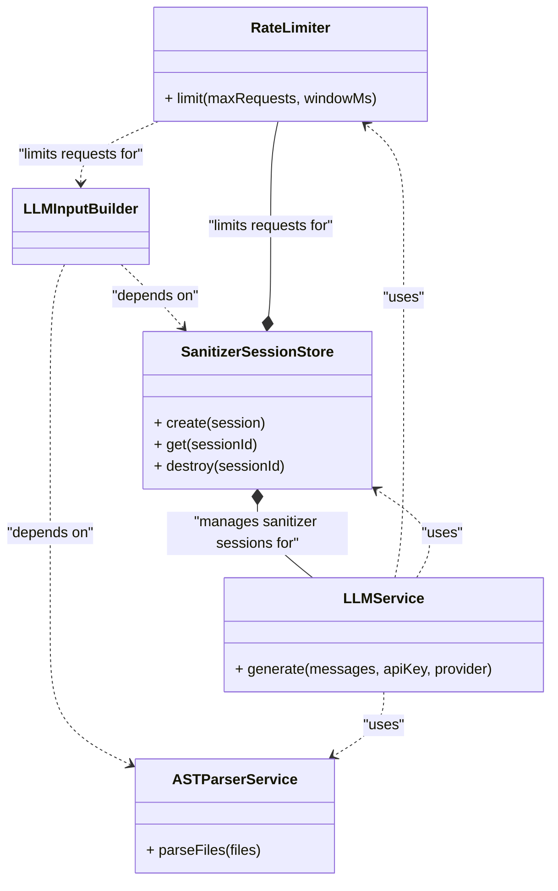

# 📚 Documentation: Auto-Doc

> Auto-generated by Auto-Doc on 2026-05-18 14:23:18
> [View Live Site](https://eljaouadimazen.github.io/Auto-Doc/)

---

## Project Overview
The Auto-Doc project is a backend application built using Express.js, providing a REST API for generating documentation. Its primary purpose is to handle API requests for generating documentation, managing sanitization rules, and interacting with external services. The application utilizes various middleware, including rate limiting and sanitization, to ensure secure and efficient processing of requests. The main functionality of the project appears to be centered around repository generation and documentation building, with a focus on API key validation and rule management.

---

## Architecture
The backend project is structured into several layers, including controllers, services, and other components. Based on the detected layers, the following roles and responsibilities can be identified:

* **Controllers**: The `generator.controller.js` file is responsible for handling Express routes and REST API requests. It is likely that this controller interacts with the services layer to perform business logic operations.
* **Services**: The services layer consists of multiple components, including `ast-parser.service.js`, `diagram.service.js`, `llm-input-builder.service.js`, `llm.service.js`, `log-sanitizer.js`, `rate-limiter.middleware.js`, and `sanitizer-session-store.js`. These services provide a range of functionalities, such as parsing AST, building LLM input, generating LLM output, and sanitizing data. The `rate-limiter.middleware.js` service is responsible for limiting the number of requests, while the `sanitizer-session-store.js` service manages sanitizer sessions.

The relationships between these components can be visualized as follows:

This visualization illustrates the dependencies and relationships between the services, including the use of rate limiting, sanitizer session management, and AST parsing. Note that the `models` and `repositories` layers are not present in the detected layers, suggesting that the project may not be using a traditional data access object (DAO) pattern or may be using an alternative approach to data modeling and storage.

---

## API Reference
The API provides the following endpoints for interacting with the application:

### 1. Index Page
* **Method:** `GET`
* **Path:** `/`
* **Purpose:** Renders the index page

### 2. Fetch Repository
* **Method:** `POST`
* **Path:** `/fetch`
* **Purpose:** Fetches a repository

### 3. Build Input
* **Method:** `POST`
* **Path:** `/build`
* **Purpose:** Builds input for a repository

### 4. Generate Documentation
* **Method:** `POST`
* **Path:** `/generate-docs`
* **Purpose:** Generates documentation for a repository

### 5. Generate Repository
* **Method:** `POST`
* **Path:** `/generate`
* **Purpose:** Generates a repository

### 6. Health Status
* **Method:** `GET`
* **Path:** `/health`
* **Purpose:** Returns the application's health status

### 7. Validate Key
* **Method:** `POST`
* **Path:** `/validate-key`
* **Purpose:** Validates a key

### 8. Audit Logs
* **Method:** `GET`
* **Path:** `/audit`
* **Purpose:** Returns audit logs

### 9. List Rules
* **Method:** `GET`
* **Path:** `/rules`
* **Purpose:** Lists rules

### 10. Add Rule
* **Method:** `POST`
* **Path:** `/rules`
* **Purpose:** Adds a rule

### 11. Remove Rule
* **Method:** `DELETE`
* **Path:** `/rules/:id`
* **Purpose:** Removes a rule

### 12. Test Rule
* **Method:** `POST`
* **Path:** `/rules/test`
* **Purpose:** Tests a rule

### 13. Fetch Repository from GitHub
* **Method:** `POST`
* **Path:** `/fetch-repo`
* **Purpose:** Fetches a repository from GitHub

### 14. Build Input for Documentation
* **Method:** `POST`
* **Path:** `/build-input`
* **Purpose:** Builds input for documentation generation

### 15. Generate Documentation
* **Method:** `POST`
* **Path:** `/generate-docs`
* **Purpose:** Generates documentation

### 16. Validate API Key
* **Method:** `POST`
* **Path:** `/validate-key`
* **Purpose:** Validates an API key

### 17. Audit Logs
* **Method:** `GET`
* **Path:** `/audit-logs`
* **Purpose:** Returns audit logs

### 18. List Sanitization Rules
* **Method:** `GET`
* **Path:** `/rules`
* **Purpose:** Lists sanitization rules

### 19. Add Sanitization Rule
* **Method:** `POST`
* **Path:** `/rules`
* **Purpose:** Adds a sanitization rule

### 20. Remove Sanitization Rule
* **Method:** `DELETE`
* **Path:** `/rules/:id`
* **Purpose:** Removes a sanitization rule

### 21. Test Sanitization Rule
* **Method:** `POST`
* **Path:** `/test-rule`
* **Purpose:** Tests a sanitization rule

### 22. Validate API Key
* **Method:** `POST`
* **Path:** `/validate-key`
* **Purpose:** Validates an API key

### 23. List Built-in Rules
* **Method:** `GET`
* **Path:** `/rules`
* **Purpose:** Returns a list of built-in rules

### 24. Add New Rule
* **Method:** `POST`
* **Path:** `/rules`
* **Purpose:** Adds a new rule

### 25. Remove Rule
* **Method:** `DELETE`
* **Path:** `/rules/:id`
* **Purpose:** Removes a rule

### 26. Test Pattern
* **Method:** `POST`
* **Path:** `/rules/test`
* **Purpose:** Tests a pattern against sample text

### 27. Fetch Files from GitHub
* **Method:** `POST`
* **Path:** `/fetch`
* **Purpose:** Fetches files from a GitHub repository

### 28. Build Input for Generator
* **Method:** `POST`
* **Path:** `/build`
* **Purpose:** Builds input for the generator

### 29. Generate Documentation
* **Method:** `POST`
* **Path:** `/generate`
* **Purpose:** Generates documentation

Note: There are duplicate endpoints with the same method and path but different purposes. This may indicate inconsistencies in the API design. It is recommended to review and refine the API to ensure clarity and consistency.

---

## Security
Based on the detected signals, the security approach of this system appears to be minimal. With no implementation of JWT (JSON Web Tokens) or authentication mechanisms, the system does not seem to have a robust security framework in place.

No security issues were found, likely due to the lack of security features rather than the presence of effective security measures. As a result, the system may be vulnerable to various security threats.

Without further information, it is difficult to provide a more detailed analysis of the system's security posture. However, it is recommended that a comprehensive security strategy be implemented to protect the system and its users from potential security risks.

---

## Setup & Usage
To set up and use the application, follow these steps:

### Prerequisites
* Node.js (version 16 or higher) for the Express server
* npm (version 8 or higher) for package management
* Maven (version 3.8 or higher) for dependency management (if using Java-based AST parsing)

### Installation
1. Install the required dependencies for the Express server by running the following command in your terminal:
   ```bash
npm install express body-parser rate-limiter-flexible joi
```
2. If using Java-based AST parsing, install the required dependencies by running the following command in your terminal:
   ```bash
mvn install
```

### Configuration
* Create a new file named `.env` in the root directory of your project and add the following environment variables:
   * `PORT`: the port number for the Express server
   * `RATE_LIMIT`: the rate limit for the API (e.g., 100 requests per minute)
   * `LLM_INPUT_BUILDING`: the configuration for building LLM input (e.g., maximum input length)

### Running the Application
1. Start the Express server by running the following command in your terminal:
   ```bash
node server.js
```
2. Use a tool like `curl` or a REST client to send requests to the API. For example:
   ```bash
curl -X GET http://localhost:3000/api/example
```

### API Endpoints
The API provides the following endpoints:
* `GET /api/example`: an example endpoint that demonstrates the usage of the API
* `POST /api/llm-input`: an endpoint that accepts LLM input and returns the parsed AST

### Rate Limiting
The API uses rate limiting to prevent abuse. The rate limit is configured using the `RATE_LIMIT` environment variable.

### Sanitization
The API uses sanitization to prevent XSS attacks. The `joi` library is used to validate and sanitize user input.

### LLM Input Building
The API uses a custom implementation to build LLM input. The implementation is configured using the `LLM_INPUT_BUILDING` environment variable.

### AST Parsing
The API uses a Java-based AST parser to parse the LLM input. The parser is configured using the `AST_PARSER` environment variable.

Note: This documentation assumes that the codebase provides the necessary functionality for the described features. If any features are not implemented, please refer to the codebase for more information.

---

## Technical Specifications
The repository generator application is composed of several key components, each with distinct responsibilities and dependencies. The following sections group related files and describe their specific roles.

### Controllers
The controllers are responsible for handling HTTP requests, rendering views, and interacting with external services. The two primary controllers are:
* **src/app.js**: Sets up an Express.js application with various routes and middleware for the repository generator.
* **src/controllers/generator.controller.js**: Handles API requests for generating documentation and managing sanitization rules.

### Services
The services provide a layer of abstraction and encapsulate specific functionality. The services are:
* **src/services/ast-parser.service.js**: Extracts structured code intelligence from JS/TS and Python files.
* **src/services/diagram.service.js**: Selects the 8 highest-signal files for diagram generation based on file path and content.
* **src/services/llm-input-builder.service.js**: Builds input for a large language model by parsing markdown content, filtering and sanitizing files, and creating chunks for processing.
* **src/services/llm.service.js**: Provides a service for interacting with various large language models (LLMs) via different providers.

### Utilities
The utilities provide supporting functionality for the application. The primary utility is:
* **src/services/log-sanitizer.js**: Sanitizes log output to prevent secrets and API keys from leaking into server logs, error stacks, or monitoring tools.

### Tests
The tests ensure the correctness and reliability of the application. The primary test file is:
* **tests/generator.controller.test.js**: Tests the generator controller functionality, including testing, validation, and mocking.

Note: The dependencies and complexity of each component are documented in their respective sections. However, if more detailed information is required, please refer to the individual component documentation.

---

*Documentation generated automatically for `Auto-Doc` using the Multi-Agent Pipeline.*

---
*Powered by Auto-Doc*