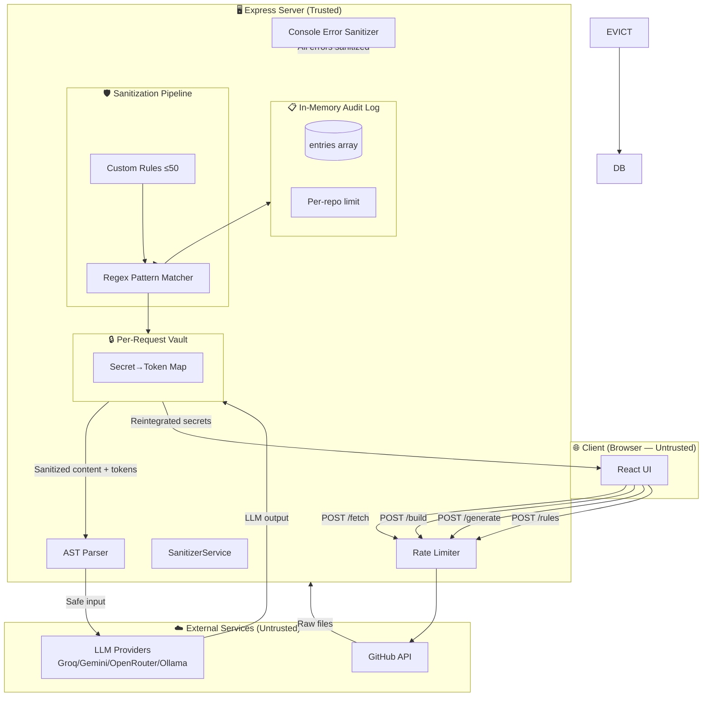
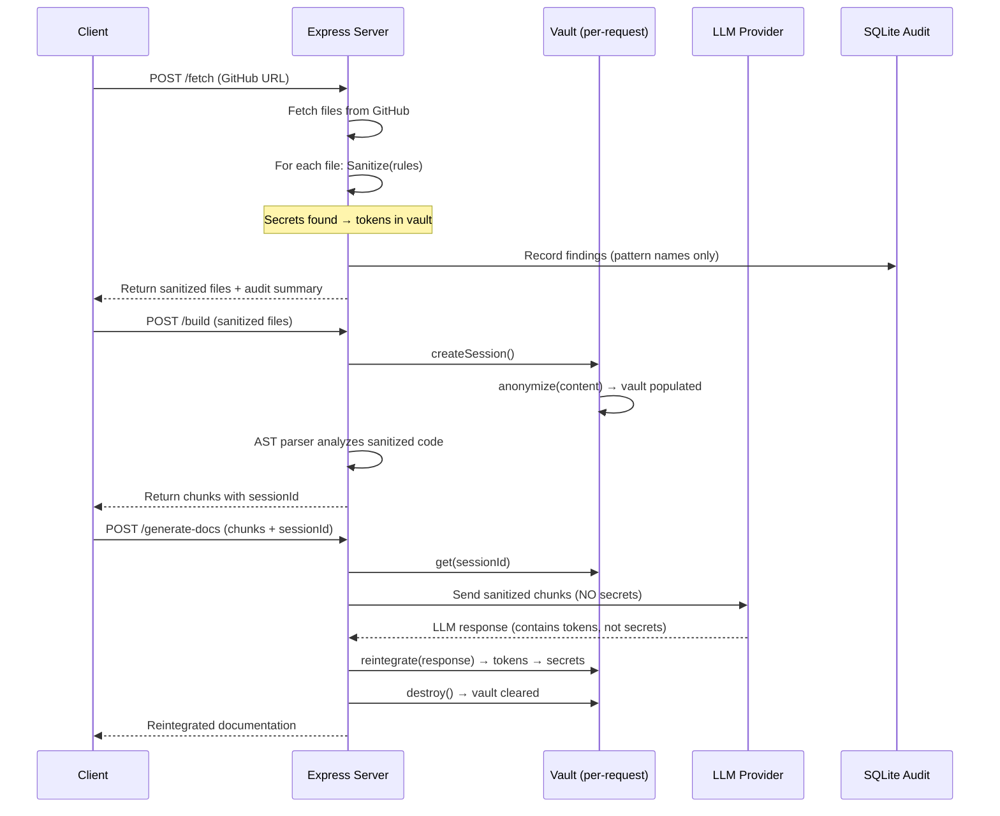

# Security Threat Model

## Architecture Overview

## Trust Boundaries

| Boundary | From | To | Protection |
|---|---|---|---|
| **B1** | Client Browser | Express Server | Rate limiting, body size limits (10MB), IPv4-only DNS |
| **B2** | Express Server | GitHub API | GITHUB_TOKEN in headers, no secrets in URL |
| **B3** | Raw Files → Sanitizer | Sanitized Content | Regex-based secret detection, vault tokenization |
| **B4** | Sanitized Content → LLM | LLM Provider Response | No secrets ever leave the vault; only tokens sent to LLM |
| **B5** | LLM Response → Reintegration | Client Response | Tokens replaced from vault; vault destroyed after use |
| **B6** | Error Paths | Server Logs | Global `console.error` sanitizer strips API keys/secrets |
| **B7** | Audit Entries | In-Memory Array | Findings stored without secret values; only pattern names. Lost on server restart. |

## Data Flow: Secret Lifecycle

## What the Vault Protects

| Asset | Before Vault | After Vault | Crosses Trust Boundary? |
|---|---|---|---|
| API Keys (`sk-...`, `gsk_...`) | Raw key | `[TOKEN_API_KEY_xxxx]` | No — token sent to LLM |
| Database URIs (`mongodb://...`) | Full URI with creds | `[TOKEN_MONGODB_URI_xxxx]` | No |
| Private Keys (PEM blocks) | Full key material | `[TOKEN_PRIVATE_KEY_xxxx]` | No |
| Passwords | Plaintext | `[TOKEN_PASSWORD_xxxx]` | No |
| JWT Tokens | Full JWT | `[TOKEN_JWT_TOKEN_xxxx]` | No |
| Email addresses | `user@domain.com` | `[TOKEN_EMAIL_xxxx]` | No |
| IP addresses | `192.168.1.1` | `[TOKEN_IP_ADDRESS_xxxx]` | No |

## Threats & Mitigations

| Threat | Risk | Mitigation | Status |
|---|---|---|---|
| **Secret leakage to LLM** | Critical | Vault tokenization — secrets never leave server | ✅ Implemented |
| **Secret leakage in error logs** | High | Global `console.error` sanitizer | ✅ Implemented |
| **Rate limit bypass** | Medium | Per-IP rate limiting on all endpoints | ✅ Implemented |
| **Unbounded memory growth** | Medium | SQLite audit log with auto-eviction, max 50 custom rules | ✅ Implemented |
| **Large payload DoS** | Medium | 10MB body limit, IPv4-only DNS | ✅ Implemented |
| **Regex false positives** | Low | Documented limitations; acceptable for defense demo | 📝 Documented |
| **AST parser bypass** | Low | Falls back to safe mode on parse failure | ✅ Implemented |
| **LLM API key exposure in URLs** | Medium | Gemini key validation STILL uses `?key=` query parameter. Only during `/validate-key`, not generation. | ⚠️ Query param still used |
| **No security headers** | Medium | Missing CSP, HSTS, X-Frame-Options | ⚠️ Planned |
| **Container vulnerabilities** | Medium | No Trivy/Scout scanning in CI | ⚠️ Planned |

## Sanitization Pattern Coverage
- **API Keys**: `api_key`, `secret_key`, `access_token`, `token`, `openai_key`, `groq_key`, `google_api_key`, `aws_key`, `stripe_key`, `sendgrid_key`, `npm_token`, `mailchimp_key`, `firebase_key`, `heroku_api_key`
- **Tokens**: `github_pat`, `github_actions`, `slack_token`, `twilio_token`, `jwt_token`, `bearer_token`
- **Database URIs**: `mongodb_uri`, `postgres_uri`, `mysql_uri`, `redis_uri`
- **Cryptographic**: `private_key_block`, `ssh_private_key`, `certificate`
- **PII**: `email`, `phone_us`, `phone_intl`, `ssn`, `credit_card`, `ip_address`, `ipv6`, `mac_address`, `iban`, `date_of_birth`, `passport`, `national_id`
- **Auth**: `password`, `passwd`, `basic_auth_url`, `cloudinary_url`
- **Environment**: `dotenv_value`

Custom rules can be added at runtime (max 50, enforced).
