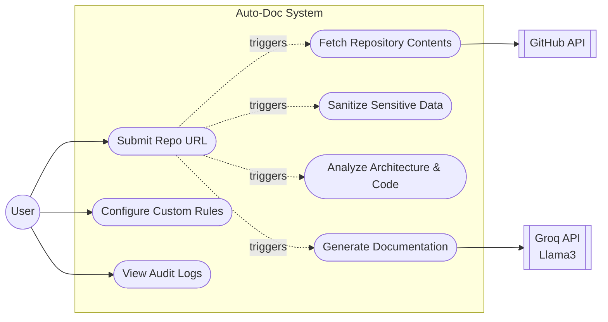
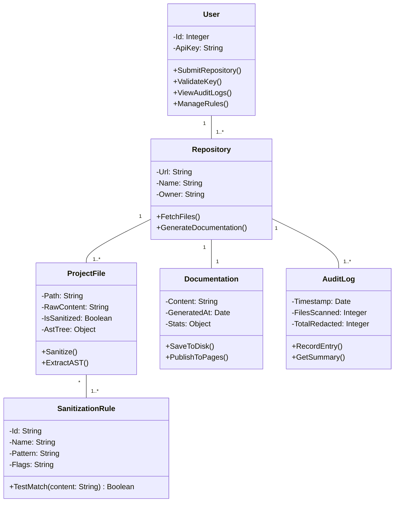
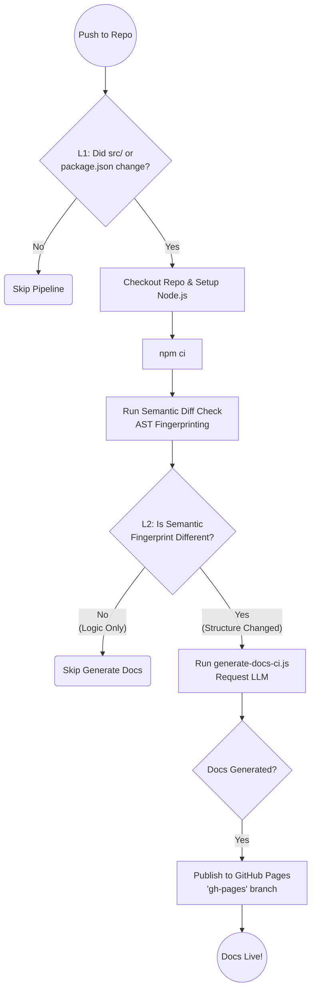

# Object-Oriented Design & Diagrams

While your `safe-file-generator` codebase does use Javascript `class` keywords (especially within your Agentic system), the project currently implements what's known as the **Singleton Pattern** and **Procedural-like Routing**. This means services are instantiated once globally and imported directly where needed, and data is passed around as raw objects (`{ path, content }`) instead of instances of Domain Models.

To make this a formal Object-Oriented Programming (OOP) project (which is exactly what's needed to build a proper Class Diagram for school, documentation, or presentations), you need to introduce three main concepts:

### 1. Domain Entities (Models)
Instead of passing JSON-like objects back and forth, create classes that represent the core "things" in your system.
* **`ProjectFile`**: Contains the file path, raw content, and AST metadata.
* **`SecurityAudit`**: Represents the risk level and redaction history.
* **`DocumentationResult`**: Contains the generated markdown and pipeline stats.

### 2. Dependency Injection (DI)
Currently, `GeneratorController` directly imports `github.service` and `llm.service`. In a strictly OOP system, tools depend on **Interfaces/Abstract Classes** and instances are passed into the constructor.
* Example: `class GeneratorController { constructor(repoService, llmService) { ... } }`
* Why? Because it shows true *Aggregation* and *Composition* in a Class Diagram rather than invisible local variables.

### 3. Abstract Classes and Interfaces
You already did a great job with this in your Agentic system using `BaseAgent`! You should carry this over to your services.
* **`BaseAgent`** (Abstract) → `OrchestratorAgent`, `SecurityAgent`
* **`IProviderService`** (Interface) → `GitHubService`
* **`ILLMService`** (Interface) → `GroqService`

Below are the Mermaid diagrams you requested based on this proposed strict-OOP approach.

---

## 1. Use Case Diagram
This diagram shows how users interact with the system and what external systems (GitHub, LLMs) are involved.

---

## 2. OOP Class Diagram
This captures the structural implementation of the system. Note the use of inheritance (`<|--`), aggregation (`o--`), and dependency injection.

---

## 3. CI/CD Pipeline Diagram
This is a flowchart representing the operational workflow documented in your `CI-CD.md`, illustrating the two-layer smart triggering system.

